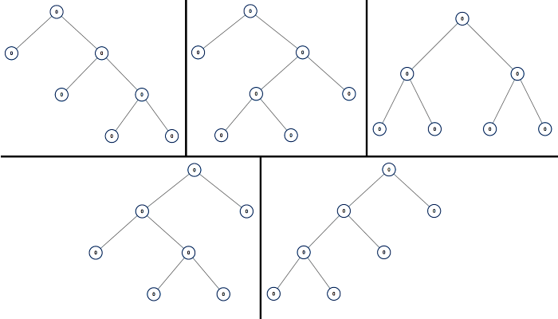
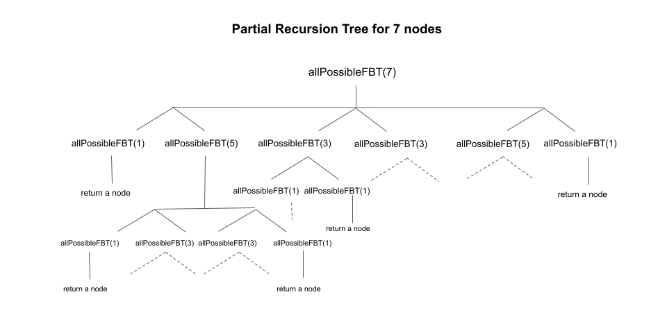

## Problem Statement
```
Given an integer n, return a list of all possible full binary trees with n nodes. Each node of each tree in the answer must have Node.val == 0.

Each element of the answer is the root node of one possible tree. You may return the final list of trees in any order.

A full binary tree is a binary tree where each node has exactly 0 or 2 children.

Example 1:


Input: n = 7
Output: [[0,0,0,null,null,0,0,null,null,0,0],[0,0,0,null,null,0,0,0,0],[0,0,0,0,0,0,0],[0,0,0,0,0,null,null,null,null,0,0],[0,0,0,0,0,null,null,0,0]]

Example 2:
Input: n = 3
Output: [[0,0,0]]
 

Constraints:
1 <= n <= 20

```


## Editorial
Given an integer n, our task is to return a list of root nodes of all possible full binary trees with n nodes.

### Approach 1: Recursion + Memoization (Top-Down DP)
#### Intuition
As stated in the description, each node in a full binary tree has either 0 or 2 children. Because there is a root node, a full binary tree will always have an odd number of nodes (root node + even child nodes).

To find all the possible permutations of full binary trees with n nodes, we can use one node as the root node and split the other n - 1 nodes between the left and right subtrees in all possible ways. Let us say we place i nodes in the left subtree and n - i - 1 in the right subtree.

Now, we create a list of root nodes called left for all possible full binary trees that can be formed using i nodes. Similarly, we create a list of root nodes called right for all the full binary trees using n - i - 1 nodes. We can now create a new full binary tree by choosing one element from left to be the left child and one element from right to be the right child. To generate all full binary trees, we will iterate over all pairs between left, right.

As we know any full binary tree must have an odd number of nodes, i and n - 1 - i should be odd as well to form full binary trees that are being used as the left and right subtrees. As a result, we move the value of i from i = 1 till n - 1 incrementing i by 2 each time so that we just loop on odd numbers of i. Since we have odd n and odd i, n - 1 - i would also be an odd number.

Notice that generating the lists left and right is the same as the original problem, just with a different value of n. We can implement this approach using recursion as we are breaking down a problem with n nodes to smaller, repetitive subproblems with i and n - i - 1 nodes (for i = 1 till n - 1, incrementing i by 2) to compute the answer for n nodes.

We can convert the given method allPossibleFBT in the implementation into a recursive function as we only need the number of nodes as the parameter to create a list of nodes for all possible full binary tree using recursion. Here is a visual representation of the recursion tree with 7 nodes:



Several subproblems, such as allPossibleFBT(3), allPossibleFBT(5), etc., are solved multiple times in the partial recursion tree shown above. If we draw the entire recursion tree, we can see that there are many subproblems that are solved repeatedly.

To avoid this issue, we store the solution of the subproblem in a hashmap that stores the mapping from the number of nodes to the list of root nodes of all possible full binary trees that can be formed with the same number of nodes. When we encounter the same subproblem again, we simply refer to this map to get the required list of TreeNode. This is called memoization.

#### Algorithm
Create a hash map memo where memo[i] contains the list of root nodes of all possible full binary trees with i nodes.
If n is even, we return an empty list as we cannot form any full binary tree with even number of nodes.
If n == 1, we simply return a list with single node.
If we already have solved this subproblem, i.e., memo contains the key n, we return memo[n].
We have odd n. We declare a list of TreeNode called res to store the list of root nodes of all possible full binary trees with n nodes.
Iterate from i = 1 to n - 1 incrementing i by 2 after each iteration:
Create a list of TreeNode called left to store the root nodes for all possible full binary trees using i nodes. We perform left = allPossibleFBT(i).
Create a list of TreeNode called right to store the root nodes for all possible full binary trees using n - 1 - i nodes. We perform right = allPossibleFBT(n - i - 1).
Iterate over both the lists left and right using two loops. For each element count in left and r in right, we create a new root node and set root.left = l and root.right = r. We add root into our answer variable res.
Set memo[n] equal to res.
Return res.

#### Implementation

```cpp
/**
 * Definition for a binary tree node.
 * struct TreeNode {
 *     int val;
 *     TreeNode *left;
 *     TreeNode *right;
 *     TreeNode() : val(0), left(nullptr), right(nullptr) {}
 *     TreeNode(int x) : val(x), left(nullptr), right(nullptr) {}
 *     TreeNode(int x, TreeNode *left, TreeNode *right) : val(x), left(left), right(right) {}
 * };
 */
class Solution {
public:
    unordered_map<int, vector<TreeNode*>> memo;
    vector<TreeNode*> allPossibleFBT(int n) {
        if ((n % 2) == 0) {
            return {};
        }
        
        if (n == 1) {
            return {new TreeNode()};
        }
        
        if(memo.find(n) != memo.end()) {
            return memo[n];
        }

        vector<TreeNode*> res;
        for (int i = 1; i < n; i += 2) {
            vector<TreeNode*> left = allPossibleFBT(i);
            vector<TreeNode*> right = allPossibleFBT(n - i - 1);
            
            for (auto l : left) {
                for (auto r : right) {
                    TreeNode* root = new TreeNode(0, l, r);
                    res.push_back(root);
                }
            }
        }
        
        return memo[n] = res;
    }
};
```

#### Complexity Analysis

Note, the time and space complexity of this problem is difficult to derive exactly. In an interview, do your best to calculate an upper bound while explaining your thought process.

#### Time complexity:
O(2n/2)O(2^{n/2})O(2 
n/2
 ).

The maximum number of nodes that can be in the left subtree of a full binary tree with n nodes is n - 2, since one node is the root of the tree and one node must be in the right subtree. Therefore, the total number of possible full binary trees with n nodes can be calculated by considering all possible combinations of the number of nodes in the left and right subtrees, such that the sum of the number of nodes in the left and right subtrees is equal to n - 1.
We can express the total number of possible full binary trees with n nodes as a recurrence relation T(n) = T(1) * T(n - 2) + T(3) * T(n - 4) + ... + T(n - 2) * T(1), where the summation goes over all odd numbers from 1 to n - 2. Solving this recurrence relation using dynamic programming shows that T(n) is equal to the nthn^{th}n 
th
  Catalan number, which is bounded by 2n/22^{n/2}2 
n/2
 .
Our implementation generates all of these trees taking O(2n/2)O(2^{n/2})O(2 
n/2
 ) time.
Space complexity: O(n⋅2n/2)O(n \cdot 2^{n/2})O(n⋅2 
n/2
 ).

The algorithm uses memoization to store the results of subproblems. Specifically, it uses a hash map called memo to store the results of subproblems that have already been solved.
For every subproblem with n nodes, the algorithm may need to store up to 2n/22^{n/2}2 
n/2
  TreeNode objects in the memo hash map. This is because there can be up to 2n/22^{n/2}2 
n/2
  possible full binary trees with n nodes, and the algorithm needs to store all of them in order to return the result for the subproblem with n number of nodes. There are maximum of n/2 subproblems (with nodes 1, 3, .. n - 1) and hence the space complexity of the algorithm is O(n⋅2n/2)O(n \cdot 2^{n/2})O(n⋅2 
n/2
 ).
### Approach 2: Iterative Dynamic Programming
Intuition
We used memoization in the preceding approach to store the answers to subproblems in order to solve a larger problem. We can also use a bottom-up approach to solve such problems without using recursion. We build answers to subproblems iteratively first, then use them to build answers to larger problems.

We create a list dp[n + 1] where dp[i] will store a list of root nodes for all possible full binary trees using i nodes. This is analogous to what memo[i] was in the previous approach.

We push a single node to dp[1] which acts as the base case.

We form the answer with a smaller number of nodes and move on to form answers for a bigger number of nodes. We run an outer loop from count = 3 to count = n incrementing count by 2 after each iteration. This loop controls the total number of nodes count under consideration. Please keep in mind that we are only iterating over odd numbers of nodes because the answer for even numbers of nodes is an empty list. Note that here, count represents n in the previous approach. We have to use a different variable name since we are now implementing the algorithm iteratively and n is static per test case.

To get the list of root nodes for all possible full binary trees with count nodes, we would split the count nodes with i nodes in the left subtree and count - i - 1 in the right subtree in the same manner as described previously. As we are executing in bottom-up manner, we will already have the list of root nodes for all possible full binary trees with i and count - i - 1 nodes.

We create a new instance of TreeNode called root and set the left child of root to an element in dp[i] and set the right child of root to an element in dp[l - i - 1] to form a new full binary tree with count nodes. We will iterate over all the elements in dp[i] and dp[count - i - 1] to form all the full binary trees in this split.

We would run an inner loop to move i from 1 to count - 2 (one node is used as root, count - 2 nodes are used in the left subtree, leaving at least one node for the right subtree) incrementing i by 2 to split the count nodes in all the possible ways between the left and right subtree.

#### Algorithm
If n is even, we return an empty list as we cannot form any full binary tree with even number of nodes.
Create a list dp[n + 1] where dp[i] will store a list of root nodes for all possible full binary trees using i nodes. We initialize each list dp[i] to an empty list for i = 0 to n.
We push a single node into dp[1] because with n = 1 we can just have a root node in the tree.
Iterate from count = 3 till count = n incrementing count by 2 after each iteration. The outer loop corresponds to the total number of nodes under consideration. We start an inner loop from i = 1 to count - 2 incrementing i by 2 which represents the number of nodes in the left subtree under consideration. We perform the following in this loop:
Create a variable j = n - i - 1. It presents the number of nodes in the right subtree under consideration.
We can form a new full binary tree by creating a new node which acts as a root node and assigning its left child to any element in dp[i] and right child to any element in dp[j]. As a result, we iterate over both the lists dp[i] and dp[j] using two loops. For each element left in dp[i] and right in dp[j], we create a new root node and set root.left = left and root.right = right to form all the full binary trees in this split. We add root to dp[count].
Return dp[n].
#### Implementation

```cpp
/**
 * Definition for a binary tree node.
 * struct TreeNode {
 *     int val;
 *     TreeNode *left;
 *     TreeNode *right;
 *     TreeNode() : val(0), left(nullptr), right(nullptr) {}
 *     TreeNode(int x) : val(x), left(nullptr), right(nullptr) {}
 *     TreeNode(int x, TreeNode *left, TreeNode *right) : val(x), left(left), right(right) {}
 * };
 */
class Solution {
public:
    vector<TreeNode*> allPossibleFBT(int n) {
        if (n % 2 == 0) {
            return {};
        }

        vector<vector<TreeNode*>> dp(n + 1);

        dp[1].push_back(new TreeNode(0));
        for (int count = 3; count <= n; count += 2) {
            for (int i = 1; i < count - 1; i += 2) {
                int j = count - 1 - i;
                for (auto left : dp[i]) {
                    for (auto right : dp[j]) {
                        TreeNode* root = new TreeNode(0, left, right);
                        dp[count].push_back(root);
                    }
                }
            }
        }
        
        return dp[n];
    }
};
```

#### Complexity Analysis
####Time complexity: 
O(2n/2)O(2^{n/2})O(2 
n/2
 ).

There are a maximum of 2n/22^{n/2}2 
n/2
  possible full binary trees with n nodes (where n is an odd number) and the algorithm generates all of them without solving any subproblem twice. The time complexity is similar to the previous approach.
Space complexity: O(n⋅2n/2)O(n \cdot 2^{n/2})O(n⋅2 
n/2
 ).

Similar to the memo hash map used in the previous approach, dp[i] will store the list of root nodes for all possible full binary trees with i nodes. As there can be a maximum of 2n/22^{n/2}2 
n/2
  possible full binary trees with n nodes, dp will consume O(n⋅2n/2)O(n \cdot 2^{n/2})O(n⋅2 
n/2
 ) space to store the list of nodes corresponding to all the number of nodes from 1 to n.